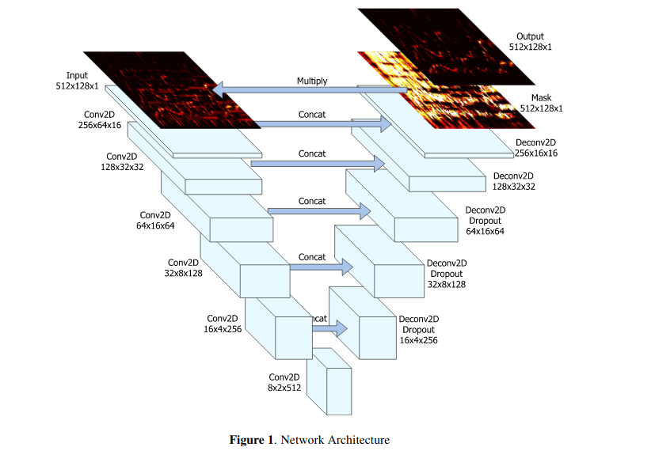

# Network Architecture for Singing Voice Separation



[<sup>Singing Voice Separation With Deep U-NET Convolutiinal Networks</sup>](https://openaccess.city.ac.uk/id/eprint/19289/1/7bb8d1600fba70dd79408775cd0c37a4ff62.pdf)   

The goal of the neural network architecture is to predict the
vocal and instrumental components of its input indirectly:
the output of the final decoder layer is a soft mask that is
multiplied element-wise with the mixed spectrogram to obtain
the final estimate. Figure 1 outlines the network architecture.
In this work, we choose to train two separate models 
for the extraction of the instrumental and vocal components 
of a signal, to allow for more divergent training
schemes for the two models in the future.

## Contraction Path

>Each encoder layer consists of a strided 2D convolution
of stride 2 and kernel size 5x5, batch normalization, and
leaky rectified linear units (ReLU) with leakiness 0.2. 


[Sequential Model](https://keras.io/guides/sequential_model/)
  : a plain stack of layers where each layer has exactly one input tensor and one output tensor.
  ```
    model = keras.Sequential([
        keras.Input(shape=(784))
        layers.Dense(32, activation='relu'),
        layers.Dense(32, activation='relu'),
        layers.Dense(32, activation='relu'),
        layers.Dense(10),
    ])
    
    # Presumably you would want to first load pre-trained weights.
    model.load_weights(...)
    
    # Freeze all layers except the last one.
    for layer in model.layers[:-1]:
      layer.trainable = False
    
    # Recompile and train (this will only update the weights of the last layer).
    model.compile(...)
    model.fit(...)
  ```
   
[2D Convolution](https://www.tensorflow.org/api_docs/python/tf/keras/layers/Conv2D#arguments_1)
  | tf.keras.layers.Conv2D
  
[ReLU activation](https://www.tensorflow.org/api_docs/python/tf/keras/layers/ReLU) | tf.keras.layers.ReLU

  + [Leaky ReLU](https://www.tensorflow.org/api_docs/python/tf/keras/layers/LeakyReLU) | tf.keras.layers.LeakyReLU
  + [Leaky ReLU in model](https://www.machinecurve.com/index.php/2019/11/12/using-leaky-relu-with-keras/#recap-what-is-leaky-relu)
    >With traditional ReLU, you directly apply it to a layer, say a Dense layer or a Conv2D layer, like this:
    
    ```model.add(Conv2D(64, kernel_size=(3, 3), activation='relu', kernel_initializer='he_uniform'))```
    
    >You don’t do this with Leaky ReLU. Instead, you have to apply it as an additional layer, and import it as such:"
    ```# In your imports
        from keras.layers import LeakyReLU
        # In your model
        # ... upstream model layers
        model.add(Conv1D(8, 1, strides=1, kernel_initializer='he_uniform'))
        model.add(LeakyReLU(alpha=0.1))
        # ... downstream model layers
    ```

[Batch normalization:](https://www.tensorflow.org/api_docs/python/tf/keras/layers/BatchNormalization)
  | tf.keras.layers.BatchNormalization
  + [Use before or after activation function?](https://machinelearningmastery.com/how-to-accelerate-learning-of-deep-neural-networks-with-batch-normalization/)
    
    In short, it depends.
    >If time and resources permit, it may be worth testing both approaches on your model and use the approach that results in the best performance.
  
<br>


####6 Encoding Layers:

    ```
    import tensorflow as tf
    from tensorflow import keras
    from tensorflow.keras import layers
    
    # model = Sequential()
    
    # 512x128x1 input layer
    #question : stride is used in conv2d and maxpool?
    
    # layer 1
    conv1 = Conv2D(input_shape=(256, 64, 16), kernel_size=(5,5), strides=2)(x)
    conv1 = BatchNormalization()(conv1)
    conv1 = LeakyReLU(alpha=0.2)(conv1)
    maxpool1 = MaxPooling2D(pool_size=(5, 5), strides=2)(conv1)
    
    conv2 = Conv2D(input_shape=(128, 32, 32), kernel_size=(5,5), strides=2)(maxpool1)
    conv2 = BatchNormalization()(conv2)
    conv2 = LeakyReLU(alpha=0.2)(conv2)
    maxpool2 = MaxPooling2D(pool_size=(5, 5), strides=2)(conv2)
    
    conv3 = Conv2D(input_shape=(64, 16, 64), kernel_size=(5,5), strides=2)(maxpool2)
    conv3 = BatchNormalization()(conv3)
    conv3 = LeakyReLU(alpha=0.2)(conv3)
    maxpool3 = MaxPooling2D(pool_size=(5, 5), strides=2)(conv3)
    
    conv4 = Conv2D(input_shape=(32, 8, 128), kernel_size=(5,5), strides=2)(maxpool3)
    conv4 = BatchNormalization()(conv4)
    conv4 = LeakyReLU(alpha=0.2)(conv4)
    maxpool4 = MaxPooling2D(pool_size=(5, 5), strides=2)(conv4)
    
    conv5 = Conv2D(input_shape=(16, 4, 256), kernel_size=(5,5), strides=2)(maxpool4)
    conv5 = BatchNormalization()(conv5)
    conv5 = LeakyReLU(alpha=0.2)(conv5)
    maxpool5 = MaxPooling2D(pool_size=(5, 5), strides=2)(conv5)
    
    conv6 = Conv2D(input_shape=(8, 2, 512), strides=2)(maxpool5)
    conv6 = BatchNormalization()(conv6)
    conv6 = LeakyReLU(alpha=0.2)(conv6)
    maxpool6 = MaxPooling2D(pool_size=(5, 5), strides=2)(conv6)
    
    
    ```


## Deconvolution Path

>In the decoder we use strided deconvolution (sometimes referred to as transposed 
convolution) with stride 2 and kernel size 5x5, batch normalization, plain ReLU, and use
50% dropout to the first three layers, as in Figure 1. In the final
layer we use a sigmoid activation function. The model is
trained using the ADAM optimizer.

[Transpose Convolution](https://www.tensorflow.org/api_docs/python/tf/keras/layers/Conv2DTranspose) | tf.keras.layers.Conv2DTranspose
+ The Transpose Convolutional layer is an inverse convolutional layer that will both upsample input and learn how to fill in details during the model training process.
[[src]](https://machinelearningmastery.com/upsampling-and-transpose-convolution-layers-for-generative-adversarial-networks/)

[Concatenating Layers](https://keras.io/api/layers/merging_layers/concatenate/) | tf.keras.layers.Concatenate
   
    ```
    x1 = tf.keras.layers.Dense(8)(np.arange(10).reshape(5, 2))
    x2 = tf.keras.layers.Dense(8)(np.arange(10, 20).reshape(5, 2))
    concatted = tf.keras.layers.Concatenate()([x1, x2])
    ```
[Drop Out](https://www.tensorflow.org/api_docs/python/tf/keras/layers/Dropout) | tf.keras.layers.Dropout
    
+ A technique where randomly selected neurons are ignored during training. 
They are “dropped-out” randomly. This means that their contribution to the activation 
of downstream neurons is temporally removed on the forward pass and any weight updates
are not applied to the neuron on the backward pass [[src]](https://machinelearningmastery.com/dropout-regularization-deep-learning-models-keras/)

[Upsampling](https://www.tensorflow.org/api_docs/python/tf/keras/layers/UpSampling2D) | tf.keras.layers.UpSampling2D
+ The Upsampling layer is a simple layer with no weights that will double the dimensions of input and can be used in a generative model when followed by a traditional convolutional layer.
[[src]](https://machinelearningmastery.com/upsampling-and-transpose-convolution-layers-for-generative-adversarial-networks/)

#### 6 Decoding Layer Dimensions (top down):

```

    # concat with conv5
    deconv1 = Conv2DTranspose(input_shape=(16, 4, 256), strides=2, activation ='relu')(
                        Concatenate()([conv5, conv6])
    deconv1 = Dropout(0.5)(deconv1)

    # concat with conv4
    deconv2 = Conv2DTranspose(input_shape=(32, 8, 128), strides=2, activation ='relu')(
                        Concatenate()([conv4, deconv1])
    deconv2 = Dropout(0.5)(conv2)

    # concat with conv3
    deconv3 = Conv2DTranspose(input_shape=(64, 16, 64), strides=2, activation ='relu')(
                        Concatenate()([conv3, deconv2])
    deconv3 = Dropout(0.5)(conv3)

    # concat with conv2
    deconv4 = Conv2DTranspose(input_shape=(128, 32, 32), strides=2, activation ='relu')
                            Concatenate()([conv2, deconv3])

    # concat with conv1
    deconv5 = Conv2DTranspose(input_shape=(256, 16, 16), strides=2, activation ='relu')(
                        Concatenate()([conv1, deconv4])

    # soft mask
    mask = Conv2DTranspose(input_shape=(512, 128, 1), strides=2, activation ='relu')
    
    # output: soft mask * spectrogram
    output = Conv2DTranspose(input_shape=(512, 128, 1), strides=2, activation ='sigmoid')
